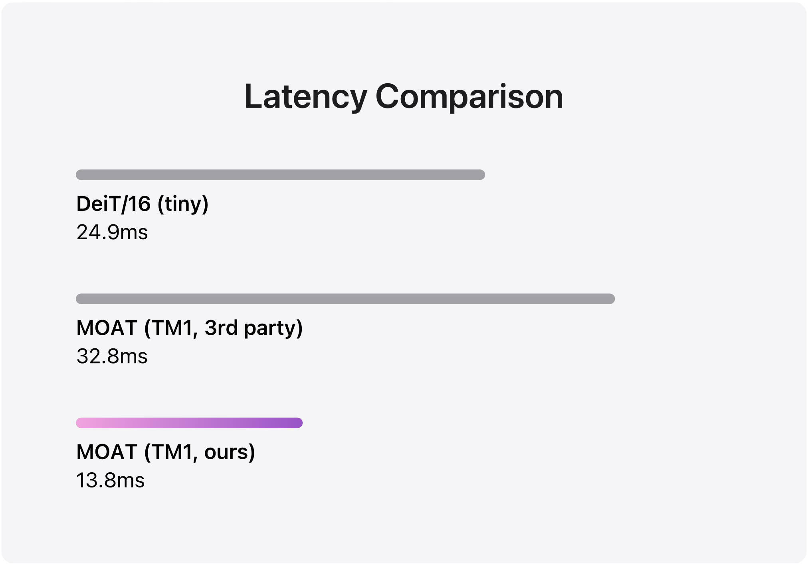
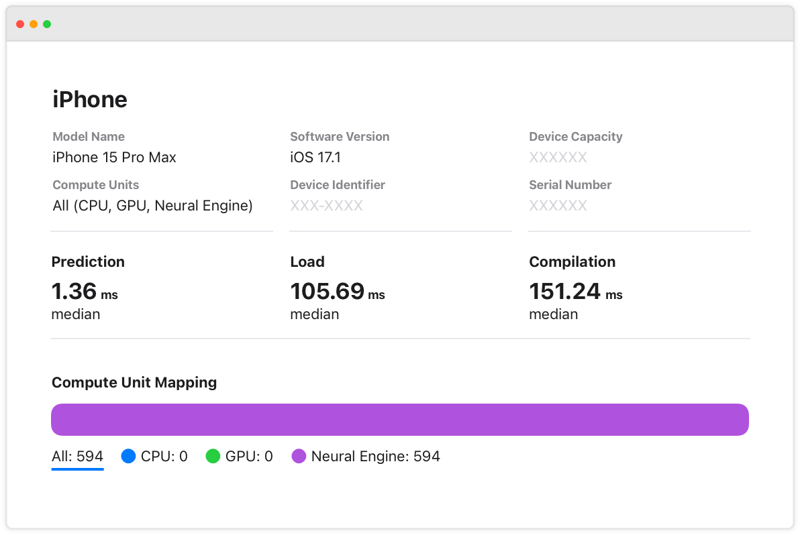

#  Efficient Vision Transformers on Apple Neural Engine

This software project accompanies the Apple ML research article [Deploying Attention-Based Vision Transformers to Apple Neural Engine](https://machinelearning.apple.com/research/vision-transformers).

This project implements attention-based vision transformer efficiently on Apple Neural Engine (ANE). We release the efficient attention module, utility functions like window_partition / window_reverse, an example hybrid CNN Transformer architecture based on [MOAT](https://arxiv.org/abs/2210.01820), and an export function that converts the model to ml program.

Please refer to our research article for detailed explanations of the optimizations on partition/reverse tensor ops, position embedding design, attention mechanism and split_softmax. 

Below are the latency comparison between different models. Our optimized MOAT is multiple times faster than the [3rd party implementation](https://github.com/RooKichenn/pytorch-MOAT) on ANE, and also much faster than the optimized DeiT/16 (tiny).





## Getting Started
Install dependencies:
```
pip install torch coremltools pytest timm
```
## Usage
To use the attention module
```python 
import torch
from vision_transformers.attention_utils import (
    WindowAttention,
    PEType,
    window_partition,
    window_reverse,
)

H, W, C = 16, 16, 32
num_heads = 2
# window based attention
window_size = (8, 8)
x = torch.rand((1, H, W, C))
window_attention = WindowAttention(
    dim=C,
    window_size=window_size,
    num_heads=num_heads,
    split_head=True,
    pe_type=PEType.SINGLE_HEAD_RPE,
)
windows = window_partition(x, window_size)
windows_reshape = windows.reshape((-1, window_size[0] * window_size[1], C))
attn_windows = window_attention(windows_reshape)
output = window_reverse(attn_windows, window_size, H, W)

# global attention, window size will be the full res of feature map
global_attention = WindowAttention(
    dim=C,
    window_size=(H, W),
    num_heads=num_heads,
    split_head=True,
    pe_type=PEType.SINGLE_HEAD_RPE,
)
global_reshape = x.reshape(1, H * W, C)
global_output = global_attention(global_reshape)
```
To construct MOAT architecture:
```python
from vision_transformers.model import _build_model

image_height, image_width = 256, 256
model_config, model = _build_model(
    shape=(1, 3, image_height, image_width),
    base_arch="tiny-moat-0",
    attention_mode="global",
    output_stride=32,
)
```
To export ml model that runs on ANE
```
$ python export.py
```
To verify performance, developers can now launch Xcode and simply add this model package file as a resource in their projects. After clicking on the Performance tab, the developer can generate a performance report on locally available devices. The figure below shows a performance report generated for this model on a list of iPhone devices.


To customize model hyperparameter, and profile the exported model, refer to the section **Model Export Walk-Through** in the blog.

## Unit Tests
We provide unit tests to ensure the build and export parts function correctly, also can be used as examples.
To run the unit tests:
```
pytest tests.py
```
